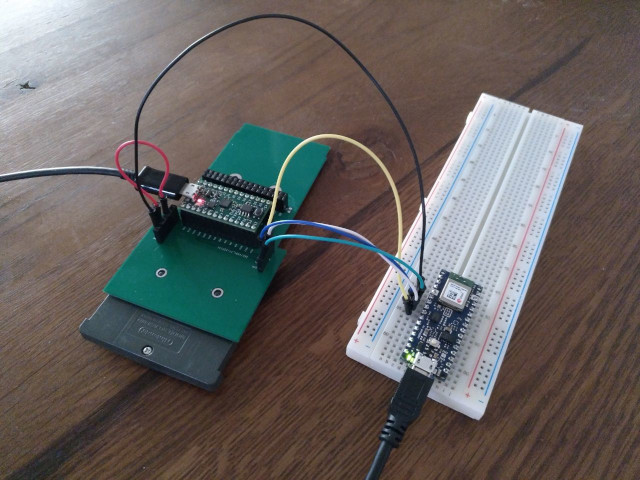

# Cartridge reader

...

## Setup

An Arduino Nano 33 BLE is connected to a TinyFPGA BX over SPI.

| Name | Arduino Nano 33 BLE | Wire | Board | TinyFPGA BX |
| ---- | ---- | ---- | ---- | ---- |
| GND | GND | black | GND | GND | GND |
| MISO | D2 (2) | green | EXT0 | 1 (A2) |
| MOSI | D3 (3) | blue | EXT1 | 2 (A1) |
| SCK | D4 (4) | white | EXT2 | 3 (B1) |
| SS | D5 (5) | yellow | EXT3 | 4 (C2) |

The cartridge is powered by the TinyFPGA BX, i.e. `VCC_CART` is connected to `VOUT`.

## Cartridge behaviour

The cartridge has the following pins:

 * 1: VCC, at 3.3V.
 * 2: PHI, the physical clock, which can be configured (disabled, 4.19MHz, 8.38MHz, 16.78MHz). See [waitstate control](https://www.akkit.org/info/gbatek.htm#gbasystemcontrol).
 * 3: ~WR, write control.
 * 4: ~RD, read control.
 * 5: ~CS, select.
 * 6-21: AD, address and data.
 * 22-29: A, address or data.
 * 30: CS2, select.
 * 31: IRQ, interrupt request. Can be left unconnected or grounded.
 * 32: GND, ground.

General comments about memory accesses:

 * Data format is always little endian, i.e. least significant byte is first.
 * Depending on the requested (virtual) address and operation, the GameBoy will either assume ROM or RAM when accessing the cartridge.
 * Since GamePak ROM bus is 16-bits, ARM instructions (32-bits) are slow to fetch. It is better to use THUMB instructions, or copy the code in WRAM.
 * GamePak accesses can be either sequential or non-sequential. The first access to a random location in ROM must be non-sequential.
 * The GameBoy will wait a few cycles when accessing memory. Up to 3 configurations can be used (useful if the cartridge has multiple ROM units with different physical properties). By default, it will assume 4 cycles for random access, and then 2 cycles for sequential access. See [waitstate control](https://www.akkit.org/info/gbatek.htm#gbasystemcontrol).

A read access from the ROM is done as follows:

 * On `~CS` falling-edge, the cartridge latches A0-A23 as address.
 * On `~RD` falling-edge, the cartridge fetches the data at latched address and outputs D0-D15. The output must be ready by next rising-edge of `~RD` (depends on waitstates).
 * On `~RD` rising-edge, the cartridge increments latched address by one (i.e. allow sequential read by just strobing `~RD`).
 * On `~CS` rising-edge, the transaction is done.

Note that ROM data is 16-bits, hence data is aligned on 2-bytes steps. This means the implicit first bit of the address is always 0 (i.e. A0-A23 is the address divided by 2).

Therefore, a simple read-only GamePak ROM does not use `PHI`, `~WR`, `~CS2` and `IRQ`.

It should also be possible to write to ROM, using a similar scheme, but with `~WR` instead of `~RD`.
To be tested.

Also note that the `AD` bus is used in both direction.
The cartridge should actively write only when both `~CS` and `~WR` are low.

Links:

 * https://www.gbadev.org/
 * https://www.akkit.org/info/gbatek.htm#auxgbagamepakbus
 * https://www.darkfader.net/gba/
 * http://files.darkfader.net/gba/files/cartridge.txt
 * https://douevenknow.us/post/68126856498/arduino-based-gba-rom-dumper-part-1
 * https://reinerziegler.de.mirrors.gg8.se/GBA/gba.htm
 * https://dhole.github.io/post/gameboy_cartridge_emu_1/
 * https://retrocomputing.stackexchange.com/questions/11732/how-does-the-gameboys-memory-bank-switching-work
 * http://www.dl9sec.de/prj_gbacart.html
 * https://github.com/uXeBoy/GBA
 * http://bitwise.bperki.com/2018/08/08/custom-game-boy-cartridge-project-update-1/
 * https://www.insidegadgets.com/2018/04/18/building-a-2mb-mbc5-gameboy-cart-part-1-cpld-as-the-mbc-and-adding-flash-as-our-rom/
 * https://github.com/dwaq/Homebrew-Gameboy-Cartridge
 * http://www.hardwarebook.info/Game_Pak
 * https://www.insidegadgets.com/2011/03/19/gbcartread-arduino-based-gameboy-cart-reader-%E2%80%93-part-1-read-the-rom/
 * https://github.com/Shyri/gba-bt-hid
 * https://github.com/uXeBoy/GBArduboy
